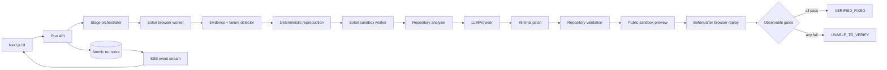

# WIWO

**Will it? Won't it?**

Autonomous software QA powered by Solari.

`URL → Discover → Reproduce → Fix → Deploy → Verify`

WIWO accepts a live application URL, an optional public GitHub repository, and a natural-language objective. It uses a real Solari cloud browser to exercise the product, collects observable failure signals, repeats the exact workflow, and—when source is available—attempts a minimal repair inside an isolated Solari sandbox. A fix is never called verified until repository checks pass and the original workflow succeeds against the patched public preview.

> WIWO is an execution system, not a simulated dashboard. Every timeline entry and artifact comes from backend work. Missing credentials produce a visible failed run; they never trigger manufactured results.

## Demo

The capture location for a competition demo is [`docs/demo.mp4`](docs/demo.mp4) (add the recorded walkthrough before submission). Until a real run has been recorded, the UI intentionally shows no canned success case.

A concise demo should show:

1. Submit a live target, repository, and objective.
2. Watch real browser decisions arrive in the event timeline.
3. Inspect the reproduced finding, Solari session replay, and before screenshot.
4. Review the minimal diff and actual validation commands.
5. Open the sandbox preview and the after screenshot.
6. Confirm that `VERIFIED_FIXED` appears only after every verification gate passes.

## What WIWO does

- Discovers a web workflow from page semantics and a natural-language objective.
- Interacts through accessible names, labels, roles, visible text, and semantic recovery—not only CSS selectors.
- Captures document/XHR/fetch failures, failed requests, console errors, page exceptions, visible error states, screenshots, browser steps, and Solari recording references.
- Creates a structured finding and deterministically replays its exact actions in a fresh browser.
- Clones public source only inside a Solari microVM.
- Detects the Node package manager and repository-defined lint, typecheck, test, and build scripts.
- Takes a clean failing-state Solari snapshot before changing code.
- Uses a provider-neutral LLM interface for diagnosis and minimal unified-diff generation.
- checks and applies the patch with `git apply`, validates it, starts the repository service, obtains a real Solari preview URL, and replays the original workflow.
- Persists runs as atomic, permission-restricted JSON records and streams real events to the UI over Server-Sent Events.

## Architecture



The pipeline is implemented as explicit `DISCOVER`, `EXECUTE`, `DETECT`, `REPRODUCE`, `DIAGNOSE`, `FIX`, `VALIDATE`, `DEPLOY_PREVIEW`, `VERIFY`, and `REPORT` stages. The browser worker and repair workspace are independent adapters; the orchestration layer owns status transitions.

## Solari capabilities used

| Capability | WIWO use |
| --- | --- |
| Cloud browsers | Playwright-compatible navigation, semantic interaction, screenshots, console/network observation |
| Session recording | Recording-enabled sessions and replay URL polling after release |
| Sandboxes | Isolated clone, install, source inspection, tests, build, patch, and service execution |
| Sandbox Git API | Shallow public repository clone and working-tree diff inspection |
| Snapshots | Checkpoint the clean failing state and restore a rejected candidate |
| Commands + files | Argument-separated commands, bounded output, source context, and patch transfer |
| Port previews | Public URL for the patched service, used by the verification browser |
| Desktop | Deliberate escalation boundary only; normal web QA does not consume a desktop session |

Desktop escalation is not routed into every run. The cookbook's current computer-use example uses the Python desktop package, while this application is TypeScript and ordinary web workflows are safer and more observable through the browser. A future native-app worker can implement the documented adapter boundary without weakening the primary path.

## Setup

Requirements:

- Node.js 20.9 or newer
- A Solari API key
- An OpenAI API key for workflow planning and source repair

```bash
cd wiwo
npm install
cp .env.example .env.local
npm run dev
```

Open [http://localhost:3000](http://localhost:3000).

### Environment variables

| Variable | Required | Purpose |
| --- | --- | --- |
| `SOLARI_API_KEY` | Yes | Creates real browser and sandbox sessions |
| `GITHUB_TOKEN` | No | Opens a pull request for a verified repair; never writes directly to the default branch |
| `LLM_PROVIDER` | No | `openai` (default) or `deepseek` |
| `OPENAI_API_KEY` | Yes for OpenAI | Natural-language browser decisions, diagnosis, and patch generation |
| `OPENAI_MODEL` | No | OpenAI structured-output model; defaults to `gpt-5-mini` |
| `DEEPSEEK_API_KEY` | Yes when `LLM_PROVIDER=deepseek` | DeepSeek reasoning, diagnosis, and patch generation |
| `DEEPSEEK_MODEL` | No | DeepSeek model; defaults to `deepseek-v4-flash` |
| `DEEPSEEK_BASE_URL` | No | DeepSeek API base URL; defaults to `https://api.deepseek.com` |
| `WIWO_MAX_BROWSER_STEPS` | No | Safe browser decision budget; defaults to 12 |
| `WIWO_RUN_TIMEOUT_MS` | No | Pipeline deadline between stages; defaults to 20 minutes |

Keys stay on the server. Never prefix them with `NEXT_PUBLIC_`.

## Running locally

```bash
npm run lint
npm run typecheck
npm test
npm run build
npm start
```

Example input:

```text
Application URL:      https://your-deployed-app.example
GitHub repository:    https://github.com/your-org/your-public-repo
Testing objective:    Test signup and login. Find anything broken and try to fix it.
```

The repository is optional. Without it, WIWO performs discovery, detection, and reproduction, then reports in QA-only mode without pretending it can repair the source.

## How autonomous verification works

A finding starts as `FOUND`. WIWO opens a fresh browser and replays captured semantic actions. It becomes `REPRODUCED` only if an equivalent observable failure signal returns. A generated diff is only `FIX_ATTEMPTED`.

`VERIFIED_FIXED` requires all of these runtime facts:

1. The original signal was reproduced.
2. A unified diff applied cleanly.
3. Every discovered practical validation script passed (and at least one existed).
4. The patched service became reachable through an actual Solari preview URL.
5. The full captured action sequence ran again.
6. The original failure fingerprint was absent.
7. No new high or critical failure signal occurred.

Model prose never satisfies these gates.

## Security model

- Only `http:` and `https:` targets are accepted; localhost, metadata hosts, `.local`, and literal private IP ranges are blocked.
- Repair mode accepts only public `https://github.com/<owner>/<repo>` URLs.
- Repository code is installed and executed only in a Solari sandbox, never in the WIWO host process.
- Commands use executable/argument separation. Package scripts are discovered from `package.json`, and script names are allow-pattern validated.
- Browser planning blocks cross-origin navigation and instructs the planner not to perform purchases, destructive actions, messaging, or irreversible changes.
- Synthetic credentials use `example.com`; secrets and authorization headers are redacted from stored output.
- Run output and source context have size caps. Browser steps, command timeouts, and run deadlines are bounded.
- Run JSON and screenshots are written with owner-only permissions. Evidence paths are strict allowlists.
- A successful preview is left alive only for the sandbox's 20-minute idle window, then Solari releases it. Failed workspaces are destroyed immediately.

Production deployments should additionally put authentication and authorization in front of all run/evidence routes, use a durable queue rather than an in-process worker, add DNS resolution checks to close hostname-based SSRF rebinding, and move the JSON store to transactional durable storage.

## Current limitations

- Automatic repair deliberately focuses on Node.js repositories with a root `package.json`; browser-only QA works for any web stack.
- One minimal candidate is evaluated per run. The snapshot boundary makes independent candidate workers possible without merging patches blindly.
- Browser failure equivalence uses deterministic token fingerprints over captured runtime signals. It is intentionally conservative and may leave valid fixes `UNABLE_TO_VERIFY`.
- URL validation blocks literal private IPs but does not resolve hostnames before browser navigation; deploy behind egress policy for hostile multi-tenant use.
- The local JSON/event worker design targets a long-running Node process. Serverless deployment needs a durable job queue and database.
- Solari recording URLs are signed and may expire. The session ID remains in the report.
- Preview port inference supports common `start`/`dev` scripts and defaults to port 3000.
- Test data is synthetic, but targets should still be non-production environments unless the workflow is known to be non-destructive.

## Measured results

No benchmark is claimed before credential-backed runs are captured. Record results here after running the same published target suite:

| Measure | Result |
| --- | --- |
| Credential-backed end-to-end runs | Not yet measured |
| Reproduction rate | Not yet measured |
| Verified repair rate | Not yet measured |
| Median browser steps | Not yet measured |
| False verified fixes | Not yet measured |

This explicit absence is preferable to fabricated challenge metrics.

## Future improvements

- Fork multiple sandboxes from the clean snapshot and rank independently verified diffs by size.
- Add framework-aware preview adapters and broader Python, Go, and Rust repair support.
- Add authenticated profiles for user-approved test accounts.
- Resolve target DNS with egress allow/deny policy before every navigation.
- Add a Python desktop worker for native or GUI-only escalation.
- Persist rrweb recordings to durable, access-controlled artifact storage.
